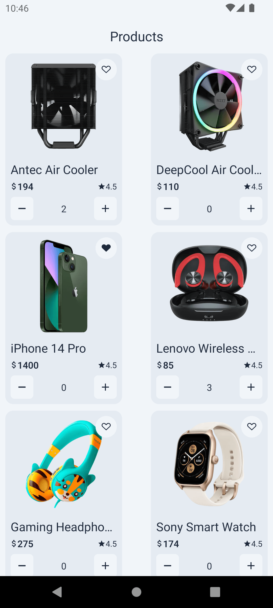

# HNG11 Task 2 - Create an app that Implements [Timbu Api](https://docs.timbu.cloud/api/intro)
Live Link: [Timbu shop App](https://appetize.io/app/android/com.ezeibekweemma.timbushop?device=pixel7&osVersion=13.0)
APK Link: [Timbu shop App](https://expo.dev/artifacts/eas/aCgW8zQ87fCkq54SLrUPxT.apk)


**Objectives**: Create a Timbu account on [timbu.cloud](http://timbu.cloud/). Get your API key (it only views once). Add some products information on your timbu account under Retail Business. Retrieve all products information using the api. Display the products on a screen in a list.

**Requirements**:
- Implementation of [Timbu API](https://docs.timbu.cloud/api/intro).
- Have a proper mobile architecture.
- The display of at least 10 products with images from the timbu api on a screen in a list.
- show relevant information of the products you have added on [timbu](http://timbu.cloud/) in the list item.
- Proper UI state management and handle errors properly.

---

## Get started

1. Clone the repository

   ```bash
   git clone https://github.com/EzeibekweEmma/tinbu-shop-app
   cd tinbu-shop-app
    ```
2. Install dependencies

   ```bash
   npm install
   ```

3. Start the app

   ```bash
    npx expo start
   ```

select the platform you want to run the app on.


## Screenshot
